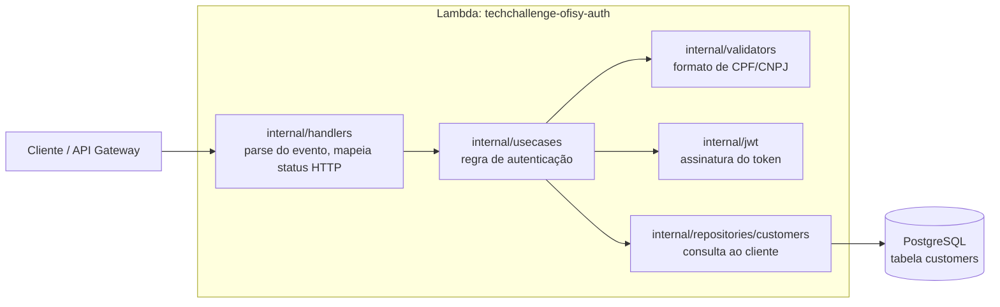

# Tech Challenge Ofisy Auth

Lambda em Go que autentica clientes por CPF/CNPJ e devolve um token JWT.

## Sobre o serviço

Este serviço implementa autenticação para os endpoints acessados pelos clientes, que anteriormente eram públicos no monolito core (techchallenge-ofisy). Não há autenticação por senha: o cliente se autentica informando CPF ou CNPJ, a Lambda valida no Postgres a existência e o status ativo do registro, e retorna um JWT assinado com HS256, utilizado pelos demais serviços para autorizar as requisições subsequentes.

## Stack

- **Go 1.26** - linguagem
- **AWS Lambda** (`aws-lambda-go`) - empacotado como `provided.al2023`/arm64
- **PostgreSQL** (`pgx` + `sqlx`) - persistência dos clientes
- **golang-jwt/jwt** - geração e assinatura do token (HS256)
- **Docker** - build da imagem da Lambda e Postgres local via Compose

## Estrutura de diretorios

```
techchallenge-ofisy-auth/
├── cmd/
│   └── lambda/
│       └── main.go              # entry point, monta as dependências e chama lambda.Start
├── internal/
│   ├── config/                  # carga e validação de variáveis de ambiente
│   ├── database/                # conexão com o Postgres
│   ├── handlers/                # adapta evento do API Gateway para o usecase
│   ├── jwt/                     # geração do token
│   ├── models/                  # structs de request/response e domínio
│   ├── repositories/customers/  # consulta ao cliente por cpf/cnpj
│   ├── usecases/                # regra de autenticação (Authenticate)
│   └── validators/              # validação de CPF/CNPJ
├── compose.yaml                 # LocalStack (Lambda) + Postgres local
├── compose.sonar.yaml           # SonarQube local para análise estática
├── sonar-project.properties     # configuração do scanner (fontes, testes, cobertura)
├── Dockerfile                   # build da imagem da Lambda
├── Makefile
└── go.mod
```

## Arquitetura



## Contrato da API

### `POST` autenticação

Recebe o CPF ou CNPJ do cliente e devolve um JWT.

**Request Body:**

```json
{
  "cpfCnpj": "52998224725"
}
```

| Campo     | Tipo   | Obrigatório | Descrição                                                 |
| --------- | ------ | ----------- | --------------------------------------------------------- |
| `cpfCnpj` | string | Sim         | CPF (11 dígitos) ou CNPJ (14 dígitos), com ou sem máscara |

**Respostas:**

| Código | Descrição                                            | Body                                              |
| ------ | ---------------------------------------------------- | ------------------------------------------------- |
| `200`  | Autenticado com sucesso                              | `{ "token": "<JWT>" }`                            |
| `400`  | Body da requisição não é um JSON válido              | `{ "error": "Corpo da requisição inválido" }`     |
| `401`  | CPF/CNPJ inválido, cliente não encontrado ou inativo | `{ "error": "Credenciais de cliente inválidas" }` |
| `500`  | Falha inesperada (banco, geração do token, etc.)     | `{ "error": "Erro interno do servidor" }`         |

O 401 nunca diferencia a causa. Formato inválido, cliente inexistente ou cliente inativo colapsam na mesma mensagem, de propósito, para não dar pista de quais CPFs/CNPJs existem na base.

Token: JWT assinado com HS256, `sub` = ID do cliente, `iss` = `techchallenge-ofisy-auth`, `exp` conforme `JWT_EXPIRATION`. Use no header `Authorization: Bearer <token>` dos demais serviços.

Exemplo com cURL, contra o endpoint publicado no API Gateway:

```bash
curl -X POST https://<api-gateway-url> \
  -H "Content-Type: application/json" \
  -d '{"cpfCnpj": "52998224725"}'
```

## Variáveis de ambiente

Veja `.env.example`:

```bash
# Banco de dados
POSTGRES_HOST=localhost
POSTGRES_PORT=5432
POSTGRES_DB=ofisydb
POSTGRES_USER=postgres
POSTGRES_PASSWORD=postgres
POSTGRES_SSL_MODE=disable

# JWT
JWT_SECRET=changeme
JWT_EXPIRATION=1h
```

`POSTGRES_USER`, `POSTGRES_PASSWORD`, `POSTGRES_DB` e `JWT_SECRET` são obrigatórios: a aplicação recusa subir sem eles. `JWT_EXPIRATION` aceita qualquer duração válida de `time.ParseDuration` (`1h`, `24h`, `30m`) e cai para `1h` se estiver ausente ou for inválida.

## Rodando o projeto

```bash
make dev-up     # sobe LocalStack (Lambda) + Postgres local (compose.yaml)
make test       # roda os testes unitários com cobertura
make vet        # go vet
make build      # compila o binário bootstrap (linux/arm64)
```

`make run` (`go run ./cmd/lambda`) sobe a aplicação e conecta no Postgres, mas `lambda.Start` exige as variáveis de ambiente da Runtime API da AWS ou a ponte RPC do SAM CLI — não dá pra mandar requisição HTTP direto contra esse processo.

Para validar a Lambda de ponta a ponta sem subir o ambiente AWS real, use o LocalStack:

```bash
make dev-up           # sobe LocalStack + Postgres
make lambda-deploy     # builda, empacota e registra a função no LocalStack
make lambda-invoke     # invoca a função com um payload de teste
```

`make lambda-deploy` cria a função `ofisy-auth` (runtime `provided.al2023`/arm64) apontando para o Postgres do compose (hostname `postgres`, mesma rede Docker). O `scripts/seed.sql` popula a tabela `customers` com registros de teste; rode-o manualmente se precisar recriá-la:

```bash
docker exec -i postgres-auth-local-db psql -U "$POSTGRES_USER" -d "$POSTGRES_DB" < scripts/seed.sql
```

Além disso, os testes unitários (`internal/handlers`, `internal/usecases`, `internal/jwt`) cobrem os quatro caminhos de resposta (200/400/401/500) com dublês do banco e do gerador de token.

`make dev-down` derruba o LocalStack e o Postgres local quando terminar.

## Análise estática (SonarQube)

O SonarQube roda localmente em container próprio (`compose.sonar.yaml`), separado do ambiente de desenvolvimento:

```bash
make sonar-up    # sobe o SonarQube em http://localhost:9000 (compose.sonar.yaml)
make sonar       # roda os testes com cobertura e envia a análise ao SonarQube
make sonar-down  # derruba o SonarQube
```

Na primeira execução, acesse `http://localhost:9000` (login inicial `admin`/`admin`), troque a senha e gere um token em *My Account > Security*. Grave-o como `SONAR_TOKEN` no `.env`, o `make sonar` falha com uma mensagem de orientação se a variável estiver ausente. Use `make sonar-logs` para acompanhar a subida do container, que leva cerca de um minuto.

`make sonar` depende de `cover-check`, então reaproveita o `coverage.txt` gerado pelo `go test -covermode=atomic` e envia a cobertura junto com o código. O scanner roda via Docker (`sonarsource/sonar-scanner-cli`), sem precisar instalar nada localmente, e lê `sonar-project.properties`, onde os arquivos `*_test.go` são classificados como testes e `volume/`/`scripts/` ficam fora da análise.
